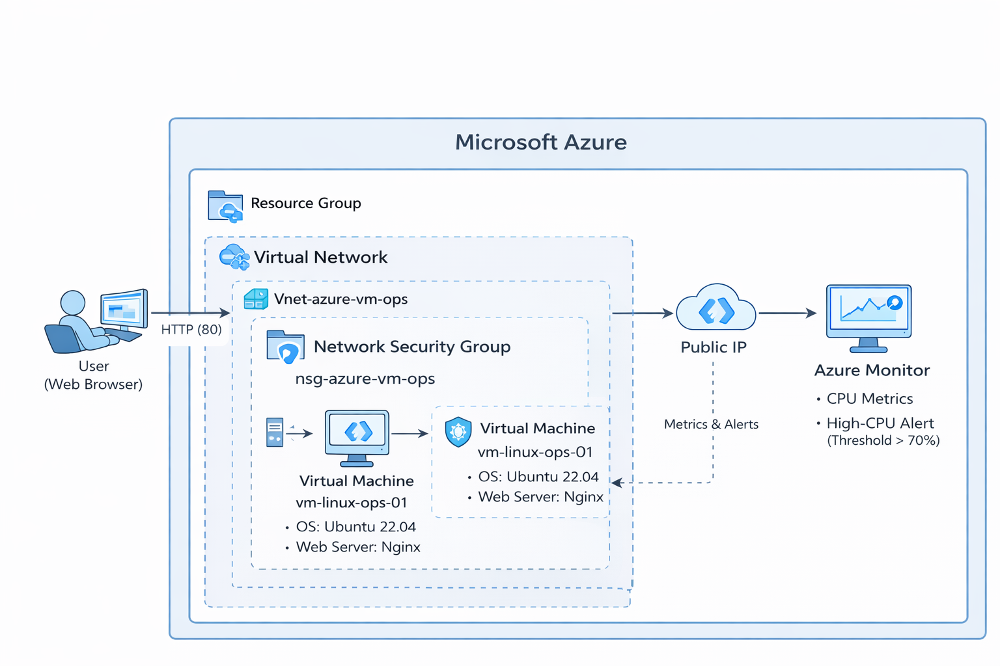

# Azure VM Operations & Monitoring

## 📌 Overview
This project demonstrates hands-on experience with Microsoft Azure cloud operations, including virtual machine provisioning, secure networking, web server deployment, monitoring, and alerting.

The project simulates real-world cloud support activities such as VM lifecycle management, network security configuration, and proactive monitoring using Azure Monitor.

---

## 🏗 Architecture

---

## Key Features
- Azure Linux Virtual Machine (Ubuntu 22.04)
- Secure networking using Virtual Network and Network Security Group (NSG)
- SSH and HTTP access control
- Nginx web server deployment
- Azure Monitor metrics and CPU-based alerting
- Operational documentation and screenshots

---

## 🧰 Azure Services Used
- Azure Virtual Machines
- Azure Virtual Network & Subnet
- Network Security Group (NSG)
- Azure Monitor & Alerts
- Public IP

---

## 🎯 Learning Outcomes
- VM lifecycle management (start, stop, deallocate)
- Secure access using NSG rules
- Application deployment on cloud VM
- Monitoring resource health using Azure Monitor
- Creating alert rules for proactive issue detection
- Cloud documentation best practices
